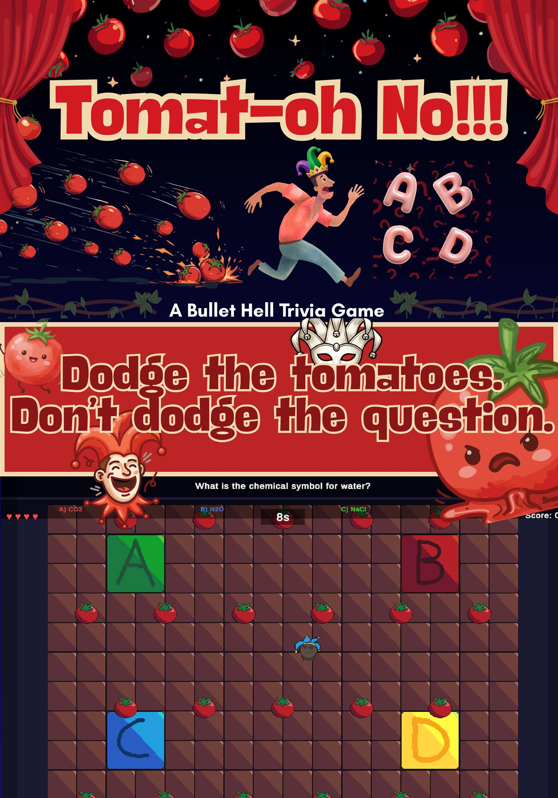

# Tomat-Oh No!!!

**A Bullet Hell Trivia Game** — *Dodge the tomatoes. Don't dodge the question.*



## What it is

You're a jester on stage. The audience hates you. They throw tomatoes. Your only way to win them over is to keep answering trivia questions correctly — every right answer chips away at the boss's HP, every wrong answer lets them heal and ramps up the projectile patterns.

The core design idea is a **dual-attention mechanic**: you have to move and dodge at the same time you're reading and answering. Either skill alone is easy. Doing both under a 12-second timer is the game.

## Play it

Grab the latest Windows build from the [Releases page](../../releases/latest), unzip, and double-click `My project.exe`.

## How it plays

- **5 HP** (hearts in the top-left). You lose HP from getting hit by tomatoes, answering wrong, or running out the timer.
- **10 boss HP** (bar in the top-right). Each correct answer takes one off; each wrong answer heals one back.
- **12-second timer** per question.
- **Four color-coded answer tiles** at the corners of the arena: <kbd>A</kbd> red, <kbd>B</kbd> blue, <kbd>C</kbd> green, <kbd>D</kbd> yellow. Walk onto a tile to lock in.
- **Two HUD modes** (toggle in the bottom-left): *Static* (question pinned to the top of the screen) or *Floating* (question follows the player).
- **Win** when the boss runs out of HP. **Lose** when you run out of HP.

## Controls

| Action | Key |
|---|---|
| Move | <kbd>W</kbd> <kbd>A</kbd> <kbd>S</kbd> <kbd>D</kbd> or arrow keys |
| Dash (short burst of speed) | check `PlayerController.cs` — typically <kbd>Shift</kbd> or <kbd>Space</kbd> |
| Select answer | walk onto the A/B/C/D tile |
| Pause | <kbd>P</kbd> |
| Reset (after game over) | <kbd>R</kbd>, or the Reset button bottom-right |

## Project layout

| Path | What's there |
| --- | --- |
| `Assets/GameScene.unity` | The actual gameplay scene |
| `Assets/Scripts/` | Game logic — see table below |
| `Assets/Resources/` | Sprites (`tomato.png`, `crowd.png`, `tile*.png`, …), SFX, BGM, and `questions.json` |
| `Assets/Prefabs/Bullet.prefab` | Tomato projectile prefab |
| `ProjectSettings/ProjectVersion.txt` | Pinned to Unity **6000.3.9f1** |

| Script | Role |
| --- | --- |
| `GameManager.cs` | Round flow, boss HP, win/lose conditions, audio cues |
| `PlayerController.cs` | Player movement, dash, HP and damage |
| `BulletSpawner.cs` | Tomato projectile patterns; ramps up on wrong answers |
| `Bullet.cs` | Per-projectile behavior |
| `AnswerTile.cs` | Floor tile that registers an answer when stepped on |
| `GridRenderer.cs` | Renders the play grid |
| `TriviaQuestion.cs` | Question data model (loaded from `Resources/questions.json`) |
| `UILayoutManager.cs` | Adapts UI for different screen sizes; Static vs Floating HUD modes |
| `ModeSwitcher.cs` | Toggles question display modes |
| `SplatEffect.cs` | Tomato hit / splat visual feedback |

To add or change trivia questions, edit `Assets/Resources/questions.json` — questions are shuffled each run.

## Build from source

1. Install [Unity Hub](https://unity.com/download) and Unity Editor **6000.3.9f1** (matches `ProjectSettings/ProjectVersion.txt`).
2. Clone this repo:
   ```
   git clone https://github.com/davidyang02/Tomat-Oh-No.git
   ```
3. In Unity Hub, **Add project from disk** and pick the cloned folder.
4. Open `Assets/GameScene.unity` and press Play.

To make a build: `File → Build Profiles → Windows`, target x64, build into a folder of your choice.

## Credits

Built as a 4-person group project for **CISC 226 Game Design** at Queen's University. This repository is maintained by **David Yang**; design, code, and creative direction were a collaborative team effort.

Third-party assets:
- Background music: [Monument_Music on Pixabay](https://pixabay.com/users/monument_music-34040748/) — used under the [Pixabay Content License](https://pixabay.com/service/license-summary/)
- Sound effects: free assets via Pixabay (Pixabay Content License)
- Font: [Liberation Sans](https://github.com/liberationfonts/liberation-fonts) (SIL Open Font License) — bundled with TextMesh Pro

## License

The **code** in this repo (everything under `Assets/Scripts/` and `Assets/Editor/`) is released under the [MIT License](LICENSE).

The **bundled audio and art assets** in `Assets/Resources/` and `Assets/TextMesh Pro/` are third-party content under their own licenses (mostly Pixabay Content License, plus the SIL OFL for Liberation Sans). They're redistributable for game use, but if you reuse them in another project please check the original source.
