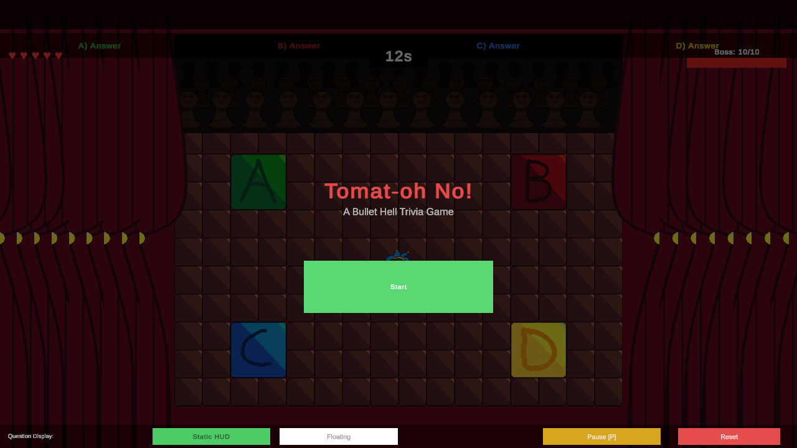

# Tomat-Oh No!

**A Bullet Hell Trivia Game** built in Unity 6 for CISC 226. Step onto the right answer tile to damage the boss; answer wrong and the boss heals while bullets come flying at you.



## Play it

Grab the latest Windows build from the [Releases page](../../releases/latest), unzip, and double-click `My project.exe`.

## Controls

- **Move** — WASD / Arrow keys
- **Select answer** — walk onto the A / B / C / D tile
- **Pause** — `P`
- **Reset** — Reset button in the bottom-right HUD

You have **5 HP** (hearts in the top-left). The boss has **10 HP** (bar in the top-right). Each question has a **12-second timer**.

## How it works

- Trivia questions are loaded each round; the player picks an answer by stepping on a tile.
- Correct answer → boss HP drops.
- Wrong answer → boss HP heals + the bullet spawner activates and fires at the player.
- Win when the boss is defeated, lose when player HP hits zero.

Core scripts live in [Assets/Scripts/](Assets/Scripts/):

| Script | Role |
| --- | --- |
| `GameManager.cs` | Round flow, boss HP, win/lose conditions |
| `PlayerController.cs` | Player movement and HP |
| `BulletSpawner.cs` | Spawns bullets when the player answers wrong |
| `Bullet.cs` | Bullet behavior |
| `AnswerTile.cs` | Floor tile that registers an answer when stepped on |
| `GridRenderer.cs` | Renders the play grid |
| `TriviaQuestion.cs` | Question data model |
| `UILayoutManager.cs` | Adapts UI to screen size |
| `ModeSwitcher.cs` | Toggles between game modes |
| `SplatEffect.cs` | Visual splat / hit feedback |

## Build from source

1. Install [Unity Hub](https://unity.com/download) and Unity Editor **6000.3.9f1** (the version this project was built with — see `ProjectSettings/ProjectVersion.txt`).
2. Clone this repo:
   ```
   git clone https://github.com/davidyang02/Tomat-Oh-No.git
   ```
3. In Unity Hub, **Add project from disk** and pick the cloned folder.
4. Open `Assets/GameScene.unity` and press Play.

## Credits

- Code, design, and game logic: David Yang
- Background music: ["Monument" (Your Game Comedy)](https://pixabay.com/users/monument_music-34040748/) by Monument_Music on Pixabay — used under the [Pixabay Content License](https://pixabay.com/service/license-summary/)
- Sound effects: free assets via Pixabay (Pixabay Content License)
- Font: [Liberation Sans](https://github.com/liberationfonts/liberation-fonts) (SIL Open Font License) — bundled with TextMesh Pro

## License

The **code** in this repo (everything under `Assets/Scripts/` and `Assets/Editor/`) is released under the [MIT License](LICENSE).

The **bundled audio and art assets** in `Assets/Resources/` and `Assets/TextMesh Pro/` are third-party content under their own licenses (mostly Pixabay Content License, plus the SIL OFL for Liberation Sans). They are redistributable for game use, but if you reuse them in another project please check the original source.
